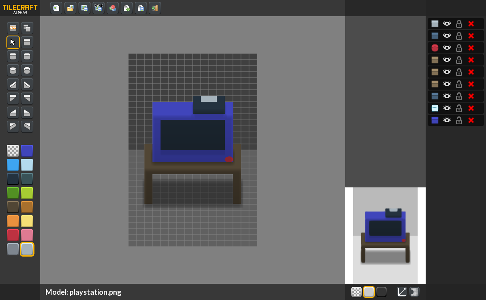

# TileCraft

2.5D fast multi-platform modeling tool to make tiles for games, icons or whatever you want!

## History & Intent behind the fork

Originally proposed as a prototyping challenge by [lostgarden.com](http://www.lostgarden.com/2013/10/prototyping-challenge-3d-modeling-tool.html),
[AngryOctupus](http://www.angryoctopus.co.nz/) built the first prototype (called [LGModeler](https://github.com/angryoctopus/lgmodeler)).
[Simone Cingano](http://akifox.com) used this as a base for the  ["TileCraft" fork](https://github.com/yupswing/TileCraft).

It's been a few years now, and the TileCraft downloads ~are [dead links](https://github.com/yupswing/TileCraft/issues/9)~ have been [re-uploaded](https://github.com/yupswing/TileCraft/releases/tag/v1.0.0-alpha.9). Moreover, it's almost impossible to compile it as haxe and openfl have had multiple breaking changes since the last commit on May 16, 2015 (unfortunately, haxe/haxelib/neko/library dependency version numbers weren't documented).

The objective of this fork is to maintain instructions on how to get the TileCraft fork to compile.

  - [x] Instructions tested on linux
  - [ ] Instructions tested on mac
  - [ ] Instructions tested on windows

### LGModeler


### TileCraft




## Compiling & Building

0) Clone the repo & optionally uninstall existing haxe/haxelib and neko (if not, temporarily remove them from the $PATH).

    ```
    git clone https://github.com/Wulf/TileCraft

    # neko, haxe, haxelib should return nothing when entered as commands
    ```

1) Download Haxe 3.2.0 (released on 2015-05-12) for your platform, and unzip it to the `./haxe-3.2.0` folder in this repo.

2) Download Neko 2.3.0 for your platform, and unzip it to the `./neko-2.3.0` folder in this repo.

3) Set your paths and check that they are set correctly:

    ```
    # Change the next line to reflect the path to the cloned repository
    export REPO=/path/to/repo
    ./source-this-to-set-haxe-path.sh

    # now the 'neko', 'haxe', and 'haxelib' commands
    # should work and return something
    ```

    If it didn't work, do it manually:

    - Add the neko folder to $PATH, then check if `neko` is a valid command in the terminal
    - Add the haxe to $PATH, then check if `haxe` and `haxelib` are valid commands in the terminal
    - See the `source-this-to-set-haxe-path.sh` file to see other paths you may need to set

4) Install dependencies 

   `haxelib install <library> <version>`

    ```
    haxelib install openfl 3.1.4
    haxelib run openfl setup
    haxelib install lime 2.5.3
    haxelib install actuate 1.8.4
    haxelib install akifox-transform 2.2.0	
    haxelib install akifox-asynchttp 0.4.1	
    haxelib install hxcolortoolkit 1.6.0	
    haxelib install compiletime 2.5.1	
    haxelib install format 3.1.2	
    haxelib install systools 1.1.0	
    haxelib install hxcpp 3.2.94
    haxelib install https://github.com/Wulf/plik.git
    ```

5) `haxelib` likes to install the latest versions when libraries are listed as dependencies (even when you don't
    want to use those versions). To makes sure the right versions are being used:

    ```
    haxelib use openfl 3.1.4
    haxelib use lime 2.5.3
    haxelib use actuate 1.8.4
    haxelib use akifox-transform 2.2.0	
    haxelib use akifox-asynchttp 0.4.1	
    haxelib use hxcolortoolkit 1.6.0	
    haxelib use compiletime 2.5.1	
    haxelib use format 3.1.2	
    haxelib use systools 1.1.0	
    haxelib use hxcpp 3.2.94
    ```

    (Note: This updates the `.current` file to point to the right version)

6) If on windows/mac, run this once

    ```
    haxelib run lime rebuild systools [windows|mac]
    ```
    
7) Finally, run the application (you just need to run this from now on to start the application)

    ```
    haxelib run lime test [windows|mac|linux] -Dv2 -Dlegacy
    ```

    Note: you may need to set your $PATH correctly each time if you haven't added the haxe/neko folders permanently:

    ```
    # Change the next line to reflect the path to the cloned repository
    export REPO=/path/to/repo
    ./source-this-to-set-haxe-path.sh
    ```

## Dependency Version Matrix

Does not list Haxe (3.2.0) or Neko (2.3.0)

| Dependency          | Version   | Release Date |
| ------------------- | --------- | ------------ |
| openfl 		    	    | 3.1.4 	  | 2015-05-12   |
| lime 		    	      | 2.5.3 	  | 2015-05-12   |
| actuate						  | 1.8.4 	  | 2015-04-08   |
| akifox-transform		| 2.2.0	    | 2015-03-23   |
| akifox-asynchttp		| 0.4.1	    | 2015-05-08   |
| hxColorToolkit			| 1.6.0	    | 2013-12-10   |
| compiletime				  | 2.5.1	    | 2014-09-18   |
| format						  | 3.1.2	    | 2014-11-12   |
| systools						| 1.1.0	    | 2014-05-30   |
| hxcpp						    | 3.2.94    | 2015-05-11   |
| plik						    | [git](https://github.com/Wulf/plik.git) | 2015-09-22 |
